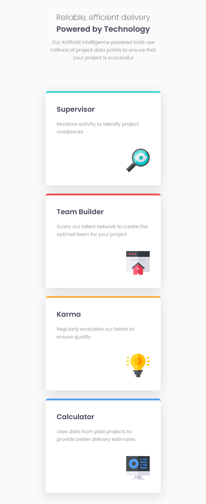
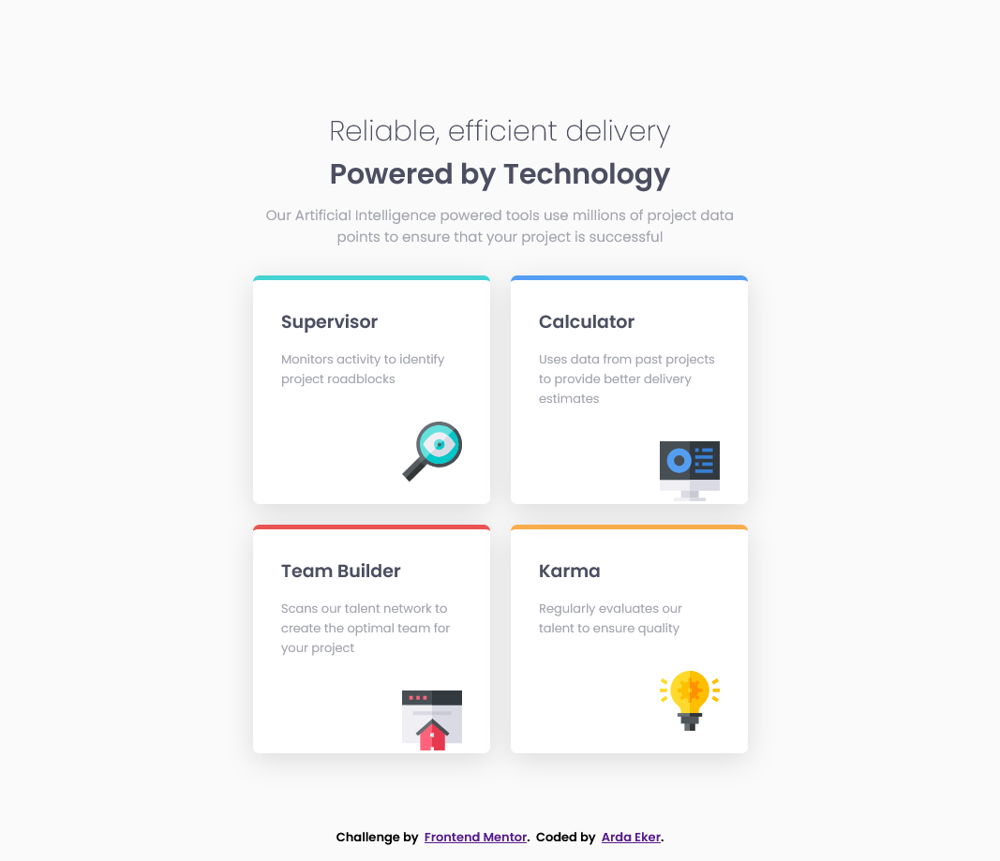
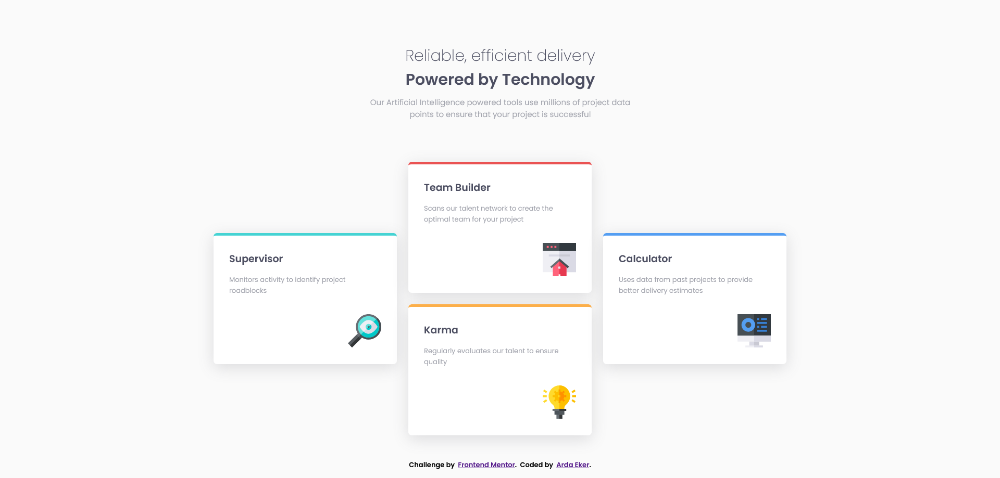

# Frontend Mentor - Four card feature section solution

This is a solution to the [Four card feature section challenge on Frontend Mentor](https://www.frontendmentor.io/challenges/four-card-feature-section-weK1eFYK). Frontend Mentor challenges help you improve your coding skills by building realistic projects.

## Table of contents

- [Frontend Mentor - Four card feature section solution](#frontend-mentor---four-card-feature-section-solution)
  - [Table of contents](#table-of-contents)
  - [Overview](#overview)
    - [The challenge](#the-challenge)
    - [Screenshot (Mobile-Tablet-Desktop)](#screenshot-mobile-tablet-desktop)
    - [Links](#links)
  - [My process](#my-process)
    - [Built with](#built-with)
  - [Author](#author)

## Overview

### The challenge

Users should be able to:

- View the optimal layout for the site depending on their device's screen size

### Screenshot (Mobile-Tablet-Desktop)

### Links

- Solution URL: [Solution URL here](https://your-solution-url.com)
- Live Site URL: [Live site URL here](https://your-live-site-url.com)

## My process

### Built with

- Semantic HTML5 markup
- CSS custom properties
- Flexbox
- CSS Grid
- Mobile-first workflow
- [React](https://reactjs.org/) - JS library
- [Framer Motion](https://www.framer.com/motion/)

## Author

- Frontend Mentor - [@ardaekerFD](https://www.frontendmentor.io/profile/ardaekerFD)
